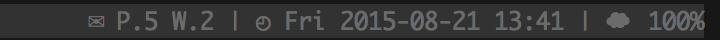
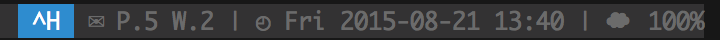

# Tmux prefix highlight

**NOTE:** This project is no longer in active development. Bugs and 
features requests won't get implemented by the project maintainers.
We still welcome discussions and community pull requests, though.

---

Plugin that highlights when you press tmux prefix key. Inspired by
[this](http://stackoverflow.com/questions/12003726/give-a-hint-when-press-prefix-key-in-tmux)
thread on stackoverflow.

Many thanks to [@obxhdx](https://github.com/obxhdx) for showing me this trick.

Prefix off:


Prefix on:


### Usage

Just add `#{prefix_highlight}` to your left/right status bar.

```tmux.conf
set -g status-right '#{prefix_highlight} | %a %Y-%m-%d %H:%M'
```

The plugin can also be configured to show when copy mode is active; see the
**Configurations** section for details.

### Installation with Tmux Plugin Manager (recommended)

Add plugin to the list of TPM plugins:

```tmux.conf
set -g @plugin 'tmux-plugins/tmux-prefix-highlight'
```

Press prefix + I to install it.

### Manual Installation

Clone the repo:

```bash
$ git clone https://github.com/tmux-plugins/tmux-prefix-highlight.git ~/clone/path
```

Add this line to your .tmux.conf:

```tmux.conf
run-shell ~/clone/path/prefix_highlight.tmux
```

Reload TMUX environment with:

```bash
$ tmux source-file ~/.tmux.conf
```

### Configurations

The colors used for the prefix highlight can be configured:

```tmux.conf
set -g @prefix_highlight_fg 'white' # default is 'colour231'
set -g @prefix_highlight_bg 'blue'  # default is 'colour04'
```

The plugin can also be configured to show when copy or synchronized panes mode
is active. If enabled, the `#{prefix_highlight}` token will be replaced with
the string `Copy` when copy mode is enabled and `Sync` for synchronized panes.
The style for copy and sync mode can be configured as a comma-separated list of
colors and attributes:

```tmux.conf
set -g @prefix_highlight_show_copy_mode 'on'
set -g @prefix_highlight_copy_mode_attr 'fg=black,bg=yellow,bold' # default is 'fg=default,bg=yellow'
set -g @prefix_highlight_show_sync_mode 'on'
set -g @prefix_highlight_sync_mode_attr 'fg=black,bg=green' # default is 'fg=default,bg=yellow'
```

The `prefix`, `copy` and `sync` prompts can also be configured:

```tmux.conf
set -g @prefix_highlight_prefix_prompt 'Wait'
set -g @prefix_highlight_copy_prompt 'Copy'
set -g @prefix_highlight_sync_prompt 'Sync'
```

Additionally, the plugin can be configured to attach optional affixes to the
value contained in `#{prefix_highlight}`.
(e.g. `< ^B >`)

```tmux.conf
set -g @prefix_highlight_output_prefix '< '
set -g @prefix_highlight_output_suffix ' >'
```

The empty (shown when prefix is off) prompt and attribute can be configured,
It is useful for aligning segments.

```tmux.conf
set -g @prefix_highlight_empty_prompt '        '          # default is '' (empty char)
set -g @prefix_highlight_empty_attr 'fg=default,bg=green' # default is 'fg=default,bg=default'
```

Defaultly, empty prompt can't be attached optional affixes.
If you want attach affixes on empty prompt, config `@prefix_highlight_empty_has_affixes` to `on`.

```tmux.conf
set -g @prefix_highlight_empty_has_affixes 'on' # default is 'off'
set -g @prefix_highlight_empty_prompt 'Tmux'
set -g @prefix_highlight_output_prefix '< '
set -g @prefix_highlight_output_suffix ' >'
```

### License

[MIT](LICENSE)
