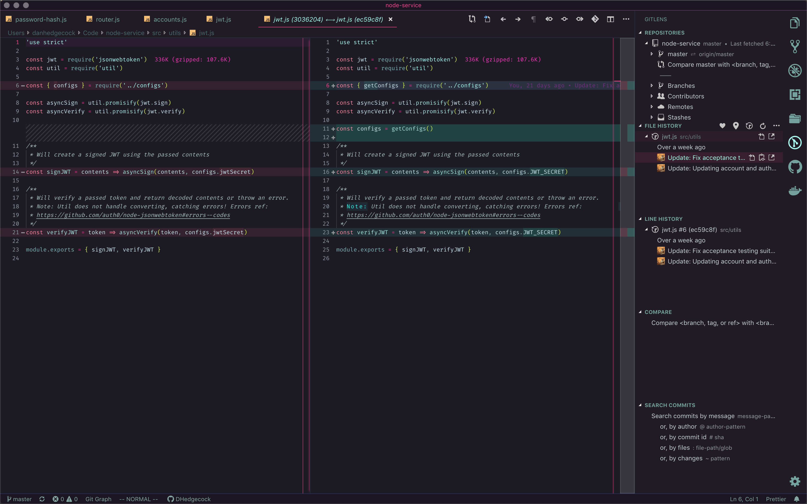
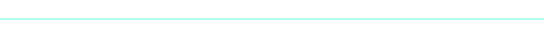
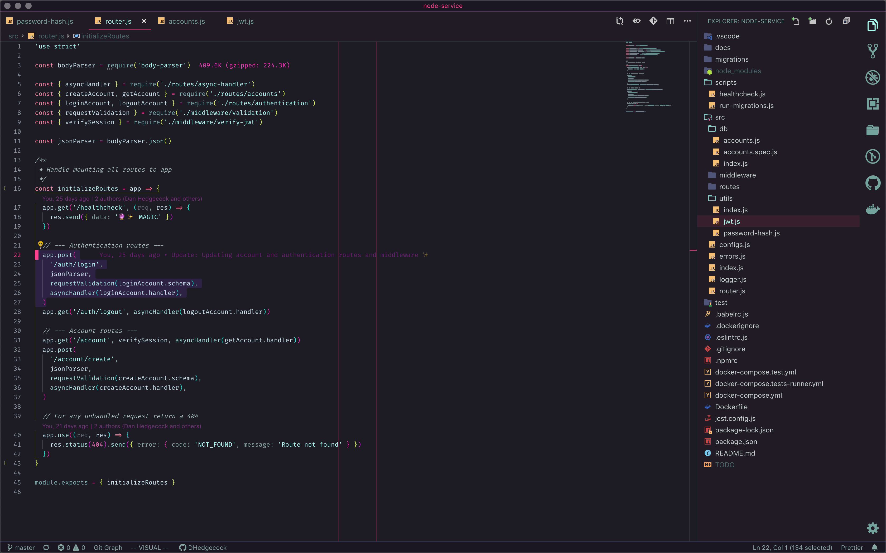
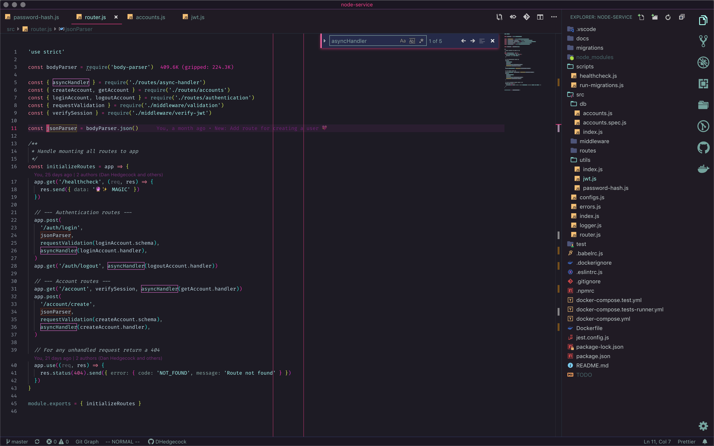

<br />
<div align="center">
  
</div>

<br />

<div align="center">
  <!-- marketplace version -->
  <a href="https://marketplace.visualstudio.com/items?itemName=dhedgecock.radical-vscode">
    
  </a>
  &nbsp;&nbsp;
  <!-- downloads -->
  <a href="https://marketplace.visualstudio.com/items?itemName=dhedgecock.radical-vscode">
    
  </a>
  &nbsp;&nbsp;
  <!-- rating -->
  <a href="https://marketplace.visualstudio.com/items?itemName=dhedgecock.radical-vscode">
    
  </a>
</div>

<br />

<div align="center">
  
</div>

<h2 align="center">
  <em>A dark theme for radical hacking inspired by retro futuristic design.</em>
</h2>

- Search and find code anywhere with optimized highlighting backgrounds and
  opacities.
- Diff code changes smartly with readable diff background colors.
- Peek view code like a pro with dark accents backgrounds and pink border
  highlights.
- Looks pretty rad ヘ( ^o^)ノ＼(^\_^ )

<div align="center">
  <br />
  <br />
  
  <h3>
    <strong>
      Peek View
    </strong>
  </h3>
</div>

The peek view background provides a dark accent to the editor background,
highlighted with pink borders. This makes peeking symbol references (⇧F12) or
peeking symbol definitions (⌥F12) stand out against the editor contents.

<div align="center">
  
</div>

<div align="center">
  <br />
  <br />
  
  <h3>
    <strong>
      Terminal Colors
    </strong>
  </h3>
</div>

Screenshots are using Powerlevel10k theme with Oh My Zsh with Meslo for the
font. _(Terminal colors are also available for iTerm in the
[Github repo](https://github.com/DHedgecock/radical-vscode/blob/main/Radical.itermcolors))_

<div align="center">
  
</div>

<!-- <h3 align="center">
  <strong>
    Diff backgrounds
  </strong>
</h3>

Diff background color use a very low opacity for readability when using the diff
editor.

<div align="center">
  
</div>

<h3 align="center">
  <strong>
    Highlighting
  </strong>
</h3>

<div align="center">
  
</div>

Highlighting theming is intended to provide useful highlighting colors while
maintaining readability. Many of the highlights can occur at the same time, so
colors were chosen that could be overlain using opacities.

<div align="center">
  
  
</div> -->

<div align="center">
  <br />
  <br />
  
  <h3>
    <strong>
      Extension Theming
    </strong>
  </h3>
</div>

If you'd like to theme some popular extensions to match Radical, these are the
colors used in the screenshots.

### Git Graph

<div align="center">
  
</div>

```json
{
  "git-graph.graphColours": [
    "#FF428E",
    "#A8FFEF",
    "#DFF959",
    "#F7A409",
    "#F834BB",
    "#2BF5E9",
    "#D831D7",
    "#FF594C"
  ]
}
```

### Bracket Pair Colorizer 2

<div align="center">
  
</div>

If you'd like to add some flair into the editor the Bracket Pair Colorizer
extension is a nice way to mix in some neon pops.

```json
{
  "bracket-pair-colorizer-2.colors": [
    "#DFF959",
    "#F834BB",
    "#2BF5E9",
    "#D831D7"
  ]
}
```

### Import Cost

<div align="center">
  
</div>

Highlight large packages using neon and translucent colors with the Import Cost
extension.

```json
{
  "importCost.smallPackageColor": "#d043cf4d",
  "importCost.mediumPackageColor": "#d043cf80",
  "importCost.largePackageColor": "#F834BB"
}
```

<div align="center">
  <br />
  <br />
  
  <h3>
    <strong>
      Feedback
    </strong>
  </h3>
</div>

Feedback on the theme is very much appreicated 🙌 There are three Github issues
in the theme repo for providing comments and suggestions directly:

- [Editor colors feedback](https://github.com/DHedgecock/radical-vscode/issues/15)
- [Syntax token colors feedback](https://github.com/DHedgecock/radical-vscode/issues/17)
- [Terminal colors feedback](https://github.com/DHedgecock/radical-vscode/issues/16)

<div align="center">
  <br />
  <br />
  
  <h3>
    <strong>
      Recommended Fonts
    </strong>
  </h3>
</div>

Theme screenshots are using the font `'Hasklug Nerd Font'`, which is a [Nerd
Font][] version of [Hasklig][]. Terminal screenshots are using the
[Powerlevel10k][] terminal theme with `MesloLGS NF` font.

[hasklig]: https://github.com/i-tu/Hasklig/
[nerd font]: https://www.nerdfonts.com/
[powerlevel10k]: https://github.com/romkatv/powerlevel10k

<div align="center">
  <br />
  <br />
  
  <h3>
    <strong>
      🙌 Thanks 💖
    </strong>
  </h3>
</div>

- The icon background is from Nate Wren's hecka rad
  [Rad Pack 80s Themed Wallpapers](https://natewren.com/rad-pack-80s-themed-hd-wallpapers/)
- The desktop background in the first screenshot is by
  [John Fowler on Unsplash](https://unsplash.com/photos/RsRTIofe0HE)

<br />
<br />

<div align="center">
  
</div>
